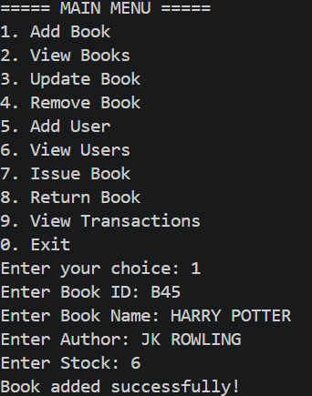
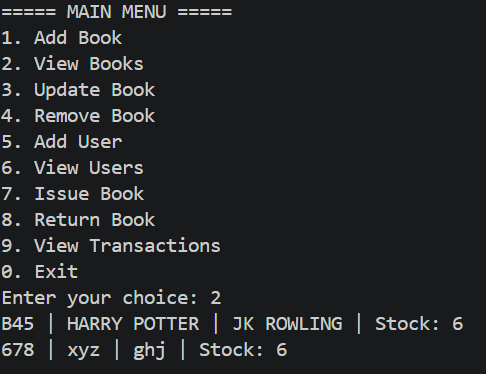
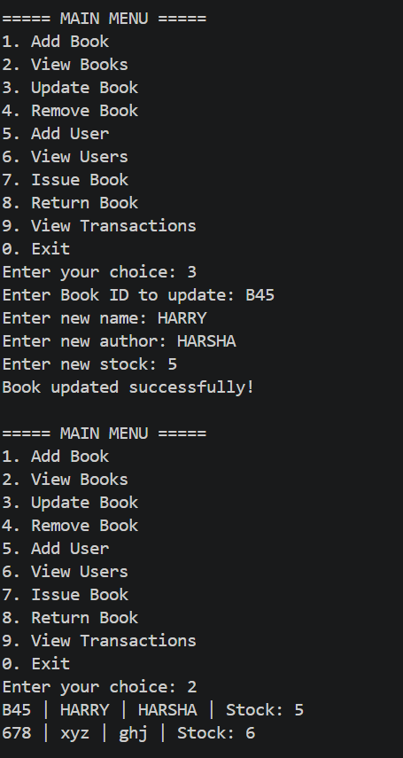
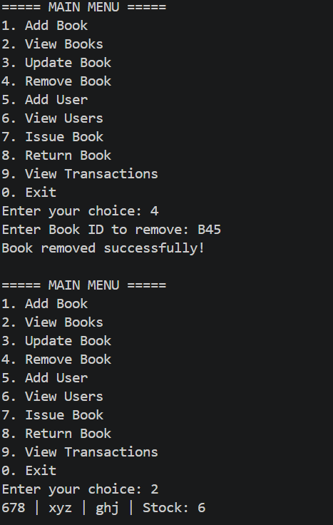
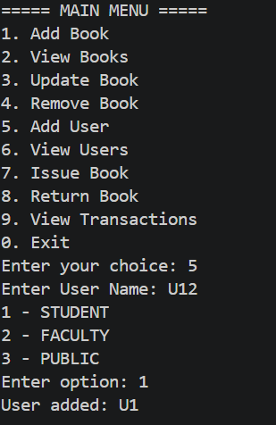
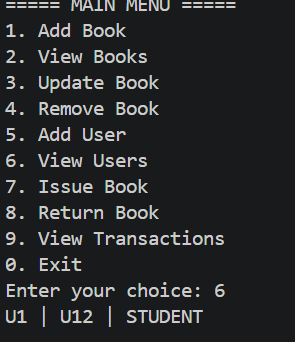
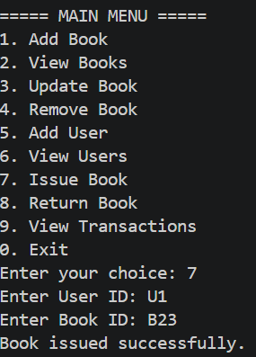
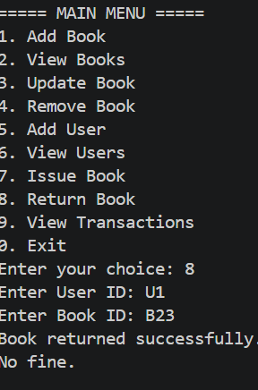
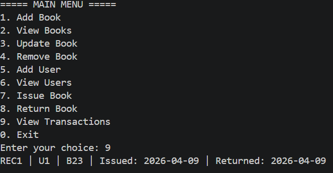

# LIBRARY_MANAGEMENT_SYSTEM
Architectural Overview
N-Tier Design: The project is divided into four distinct layers (Model, Repository, Service, and Main) to ensure the code is organized and professional.

Package Structure: Uses Java Packages to group related files, preventing "code clutter" and making the system easier to navigate.

Decoupled Logic: The User Interface (Menu) is separated from the Data Logic, meaning you could swap the console for a GUI or Database in the future without rewriting the core rules.

 Data Validation & Security
 
ID Standardization: Implements a strict "B-Prefix" rule for Book IDs to ensure every entry follows library naming conventions.

Length Constraints: Hardcoded limits on ID length prevent buffer overflows and maintain a uniform data format.

Encapsulation: Uses the private access modifier for all variables, ensuring data can only be changed through validated "Setters."
Core Functionality:
Dynamic Inventory: Automatically tracks currentStock against maxInventory to prevent checking out books that aren't physically available.

Member Registry: A dedicated repository for user management that supports searching, registering, and tracking borrower status.

Automated Transactions: Integrated checkout and return methods that handle all stock updates in a single call, reducing the risk of data errors.

Technical Implementation
Collections Framework: Leverages ArrayList for sequential data and HashMap for fast, ID-based member lookups.

StringBuilder Integration: Overrides the toString() method with StringBuilder for high-performance and neatly formatted console reports.

Polymorphic Handling: Designed to handle multiple entities (Books and Users) through a unified service layer.
THE FUNCTIONS PRESENT IN LIBRARY MANAGEMENT SYSTEM

1.ADD BOOK

2.VIEW BOOKS

3.UPDATE BOOK

4.REMOVE BOOK

5.ADD USER

6.VIEW USERS

7.ISSUE BOOK

8.RETURN BOOK

9.VIEW TRNASACTIONS

